<div align="center">

  

  <br />
  <br />

  <h1 style="font-size: 3rem; font-weight: bold; margin-bottom: 0;">Skill Bridge</h1>
  
  <p style="font-size: 1.5rem; font-style: italic; color: #666;">
    "Connect with Expert Tutors, Learn Anything"
  </p>

  <p>
    <a href="https://nextjs.org">
      
    </a>
    <a href="https://react.dev">
      
    </a>
    <a href="https://www.typescriptlang.org/">
      
    </a>
    <a href="https://tailwindcss.com/">
      
    </a>
    <a href="https://ui.shadcn.com/">
      
    </a>
  </p>

</div>

<br />

## 🚀 Overview

**Skill Bridge** is a cutting-edge full-stack platform designed to seamlessly connect eager learners with industry-expert tutors. Built with the latest web technologies, it offers a robust ecosystem for browsing, scheduling, and managing educational sessions.

Whether you want to master a new language, crack a coding interview, or learn to play the guitar, Skill Bridge provides the tools to find the perfect mentor.

---

## ✨ Outstanding Features

<table>
  <tr>
    <td width="50%" valign="top">
      <h3>👨‍🎓 For Students</h3>
      <ul>
        <li><strong>Smart Discovery:</strong> Advanced search and filtering to find tutors by subject, price, rating, and availability.</li>
        <li><strong>Seamless Booking:</strong> Real-time calendar integration for instant session scheduling.</li>
        <li><strong>Interactive Dashboard:</strong> Track learning progress, upcoming sessions, and booking history.</li>
        <li><strong>Review System:</strong> Rate tutors and leave feedback to help the community.</li>
      </ul>
    </td>
    <td width="50%" valign="top">
      <h3>👩‍🏫 For Tutors</h3>
      <ul>
        <li><strong>Professional Profile:</strong> Showcase expertise, qualifications, and portfolio.</li>
        <li><strong>Dynamic Availability:</strong> Set weekly recurring schedules and manage time slots effortlessly.</li>
        <li><strong>Analytics & Earnings:</strong> Visualized data on session performance and revenue (powered by Recharts).</li>
        <li><strong>Session Management:</strong> Accept, reject, or reschedule bookings with ease.</li>
      </ul>
    </td>
  </tr>
  <tr>
    <td colspan="2">
       <h3>🛡️ Admin & Platform</h3>
       <ul>
          <li><strong>User Moderation:</strong> Comprehensive tools to ban/unban users and maintain platform quality.</li>
          <li><strong>Category Management:</strong> CRUD operations for subject categories.</li>
          <li><strong>Secure Authentication:</strong> Role-based access control (Student, Tutor, Admin) via <code>better-auth</code>.</li>
       </ul>
    </td>
  </tr>
</table>

---

## 🛠️ Tech Stack

<div align="center">

|                                                  Framework                                                  |                                                  Language                                                  |                                                      Styling                                                      |                                               Deployment                                               |
| :---------------------------------------------------------------------------------------------------------: | :--------------------------------------------------------------------------------------------------------: | :---------------------------------------------------------------------------------------------------------------: | :----------------------------------------------------------------------------------------------------: |
| <br/>**Next.js 16** | <br/>**TypeScript** | <br/>**Tailwind 4** | <br/>**Vercel** |

</div>

<br />

## 🧩 UI Component Libraries & Utilities

This project is built with a modular UI architecture, leveraging **shadcn/ui** for accessible primitives and specialized libraries for animations and data.

### **Installed shadcn/ui Components**

<details>
<summary>Click to view all components</summary>
<br/>
<div style="display: flex; flex-wrap: wrap; gap: 5px;">
  <span style="padding: 2px 8px; border-radius: 4px; background-color: #f0f0f0; color: #333; font-size: 0.8rem; border: 1px solid #ddd;">Accordion</span>
  <span style="padding: 2px 8px; border-radius: 4px; background-color: #f0f0f0; color: #333; font-size: 0.8rem; border: 1px solid #ddd;">Alert Dialog</span>
  <span style="padding: 2px 8px; border-radius: 4px; background-color: #f0f0f0; color: #333; font-size: 0.8rem; border: 1px solid #ddd;">Avatar</span>
  <span style="padding: 2px 8px; border-radius: 4px; background-color: #f0f0f0; color: #333; font-size: 0.8rem; border: 1px solid #ddd;">Badge</span>
  <span style="padding: 2px 8px; border-radius: 4px; background-color: #f0f0f0; color: #333; font-size: 0.8rem; border: 1px solid #ddd;">Breadcrumb</span>
  <span style="padding: 2px 8px; border-radius: 4px; background-color: #f0f0f0; color: #333; font-size: 0.8rem; border: 1px solid #ddd;">Button</span>
  <span style="padding: 2px 8px; border-radius: 4px; background-color: #f0f0f0; color: #333; font-size: 0.8rem; border: 1px solid #ddd;">Calendar</span>
  <span style="padding: 2px 8px; border-radius: 4px; background-color: #f0f0f0; color: #333; font-size: 0.8rem; border: 1px solid #ddd;">Card</span>
  <span style="padding: 2px 8px; border-radius: 4px; background-color: #f0f0f0; color: #333; font-size: 0.8rem; border: 1px solid #ddd;">Chart</span>
  <span style="padding: 2px 8px; border-radius: 4px; background-color: #f0f0f0; color: #333; font-size: 0.8rem; border: 1px solid #ddd;">Checkbox</span>
  <span style="padding: 2px 8px; border-radius: 4px; background-color: #f0f0f0; color: #333; font-size: 0.8rem; border: 1px solid #ddd;">Command</span>
  <span style="padding: 2px 8px; border-radius: 4px; background-color: #f0f0f0; color: #333; font-size: 0.8rem; border: 1px solid #ddd;">Dialog</span>
  <span style="padding: 2px 8px; border-radius: 4px; background-color: #f0f0f0; color: #333; font-size: 0.8rem; border: 1px solid #ddd;">Drawer</span>
  <span style="padding: 2px 8px; border-radius: 4px; background-color: #f0f0f0; color: #333; font-size: 0.8rem; border: 1px solid #ddd;">Dropdown Menu</span>
  <span style="padding: 2px 8px; border-radius: 4px; background-color: #f0f0f0; color: #333; font-size: 0.8rem; border: 1px solid #ddd;">Form</span>
  <span style="padding: 2px 8px; border-radius: 4px; background-color: #f0f0f0; color: #333; font-size: 0.8rem; border: 1px solid #ddd;">Input</span>
  <span style="padding: 2px 8px; border-radius: 4px; background-color: #f0f0f0; color: #333; font-size: 0.8rem; border: 1px solid #ddd;">Label</span>
  <span style="padding: 2px 8px; border-radius: 4px; background-color: #f0f0f0; color: #333; font-size: 0.8rem; border: 1px solid #ddd;">Popover</span>
  <span style="padding: 2px 8px; border-radius: 4px; background-color: #f0f0f0; color: #333; font-size: 0.8rem; border: 1px solid #ddd;">Radio Group</span>
  <span style="padding: 2px 8px; border-radius: 4px; background-color: #f0f0f0; color: #333; font-size: 0.8rem; border: 1px solid #ddd;">Select</span>
  <span style="padding: 2px 8px; border-radius: 4px; background-color: #f0f0f0; color: #333; font-size: 0.8rem; border: 1px solid #ddd;">Separator</span>
  <span style="padding: 2px 8px; border-radius: 4px; background-color: #f0f0f0; color: #333; font-size: 0.8rem; border: 1px solid #ddd;">Sheet</span>
  <span style="padding: 2px 8px; border-radius: 4px; background-color: #f0f0f0; color: #333; font-size: 0.8rem; border: 1px solid #ddd;">Sidebar</span>
  <span style="padding: 2px 8px; border-radius: 4px; background-color: #f0f0f0; color: #333; font-size: 0.8rem; border: 1px solid #ddd;">Skeleton</span>
  <span style="padding: 2px 8px; border-radius: 4px; background-color: #f0f0f0; color: #333; font-size: 0.8rem; border: 1px solid #ddd;">Sonner</span>
  <span style="padding: 2px 8px; border-radius: 4px; background-color: #f0f0f0; color: #333; font-size: 0.8rem; border: 1px solid #ddd;">Table</span>
  <span style="padding: 2px 8px; border-radius: 4px; background-color: #f0f0f0; color: #333; font-size: 0.8rem; border: 1px solid #ddd;">Tabs</span>
  <span style="padding: 2px 8px; border-radius: 4px; background-color: #f0f0f0; color: #333; font-size: 0.8rem; border: 1px solid #ddd;">Textarea</span>
  <span style="padding: 2px 8px; border-radius: 4px; background-color: #f0f0f0; color: #333; font-size: 0.8rem; border: 1px solid #ddd;">Toggle</span>
  <span style="padding: 2px 8px; border-radius: 4px; background-color: #f0f0f0; color: #333; font-size: 0.8rem; border: 1px solid #ddd;">Tooltip</span>
</div>
</details>

<br />

### **Key Libraries**

| Library                      | Purpose                                      |
| :--------------------------- | :------------------------------------------- |
| **Motion** (`framer-motion`) | Declarative animations and gestures          |
| **GSAP**                     | Advanced timeline-based animations           |
| **Lenis**                    | Smooth scrolling experience                  |
| **Recharts**                 | Composable charting library                  |
| **Lucide React**             | Beautiful & consistent icons                 |
| **Better Auth**              | Secure authentication and session management |
| **React Hook Form + Zod**    | Form handling and schema validation          |
| **@dnd-kit**                 | Lightweight drag & drop toolkit              |

---

## 🔄 User Booking Flow

The core experience of Skill Bridge revolves around a frictionless booking process:

```mermaid
graph LR
    A[🔍 Discovery] -->|Filter & Search| B[📄 View Profile]
    B -->|Check Calendar| C[📅 Select Slot]
    C -->|Request Session| D{📝 Status: Pending}
    D -->|Tutor Action| E[✅ Tutor Approves]
    E -->|Status: Confirmed| F[🎓 Live Session]
    F -->|Feedback| G[⭐ Leave Review]

    style A fill:#f9f9f9,stroke:#333,stroke-width:1px
    style D fill:#fff9c4,stroke:#fbc02d,stroke-width:2px
    style E fill:#e8f5e9,stroke:#4caf50,stroke-width:2px
    style G fill:#fff3e0,stroke:#ff9800,stroke-width:1px
```



---

## 📂 Project Structure

```bash
skill-bridge-frontend/
├── public/               # Static assets (images, icons, mock JSON)
├── src/
│   ├── actions/          # Server actions (Revalidation)
│   ├── app/              # Next.js App Router
│   │   ├── (auth)/       # Authentication routes (Login, Register)
│   │   ├── (dashboard)/  # Protected dashboard layouts (Student, Tutor, Admin)
│   │   ├── (public)/     # Marketing pages (Home, Browse)
│   │   └── api/          # Internal API routes
│   ├── components/
│   │   ├── features/     # Complex domain-specific components (Booking, Auth)
│   │   ├── ui/           # Reusable shadcn/ui primitives
│   │   └── shared/       # Global components (Header, Footer)
│   ├── config/           # Environment variables
│   ├── hooks/            # Custom React hooks
│   ├── lib/              # Utilities (API client, Auth client)
│   ├── providers/        # Context providers (Theme, Lenis)
│   ├── service/          # API service layer
│   └── types/            # TypeScript definitions
├── next.config.ts        # Next.js configuration
└── package.json          # Dependencies
```

---

## ⚡ Getting Started

Follow these steps to set up the project locally.

### Prerequisites

- **Node.js:** v18 or higher
- **Package Manager:** pnpm (recommended), npm, or yarn

### Installation

1.  **Clone the repository:**

    ```bash
    git clone https://github.com/your-username/skill-bridge-frontend.git
    cd skill-bridge-frontend
    ```

2.  **Install dependencies:**

    ```bash
    pnpm install
    ```

3.  **Set up environment variables:**
    Create a `.env.local` file in the root directory and add necessary variables (see `.env.example`).

4.  **Run the development server:**

    ```bash
    pnpm dev
    ```

5.  **Open the app:**
    Visit `http://localhost:3000` in your browser.


---

<div align="center">
  <p>Made with ❤️ by <span style="color: #61dafb;">Sajid Khan</span></p>
</div>
